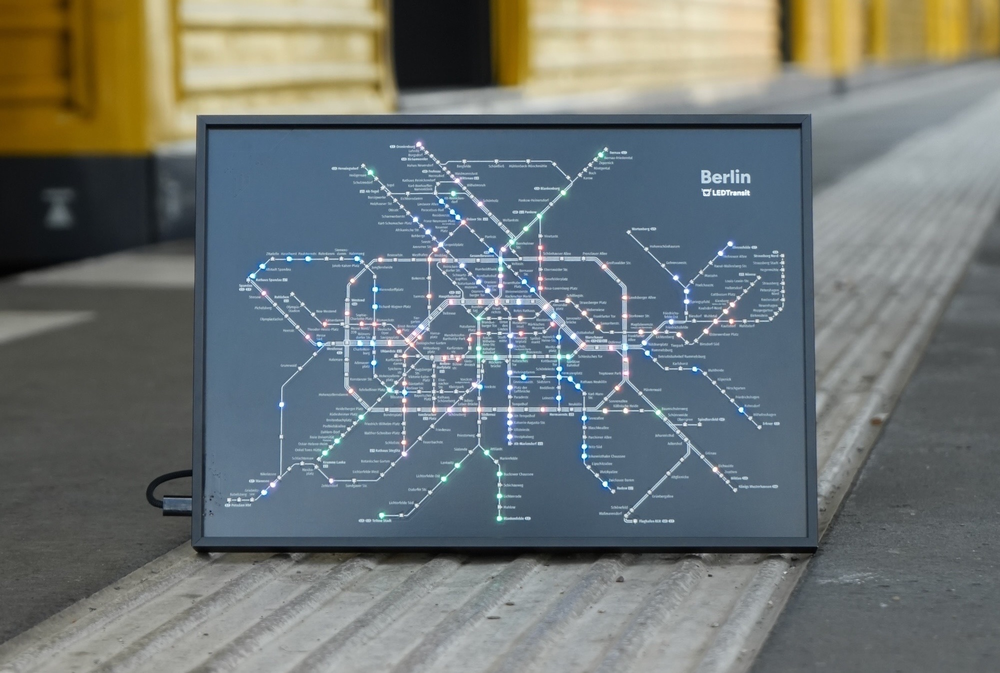

<div>

<h1>Firmware for the LEDTransit Maps</h1>
</div>

This repository contains the firmware running on the LEDTransit Maps, a series of LED-based public transport maps designed and manufactured by [LEDTransit](https://ledtransit.com/).

The maps are powered by ESP32-C3 (RISC-V) microcontrollers and feature a custom PCB with an on-board JTAG USB interface for programming and debugging, as well as an LED chain for displaying the position of public transport vehicles in real-time.

The firmware is written in Rust using the `esp-hal` and `embassy` no_std frameworks and can be built from source and installed on the device by following the instructions below.

<div class="grid" markdown>




</div>

## Toolchain installation

Required tools: Rust toolchain with the `riscv32imc` target, `probe-rs` toolkit, `espflash` flasher, `protoc` protobuf compiler.

macOS Homebrew:

```sh
curl --proto '=https' --tlsv1.2 -sSf https://sh.rustup.rs | sh
rustup toolchain install stable --component rust-src
rustup target add riscv32imc-unknown-none-elf
curl --proto '=https' --tlsv1.2 -LsSf https://github.com/probe-rs/probe-rs/releases/latest/download/probe-rs-tools-installer.sh | sh
cargo install espflash --locked
brew install protobuf
```

Linux: See [Dockerfile](assets/ci/Dockerfile) for an example of how to install the required tools on Ubuntu.

Check that the tools are correctly installed using the `xtask doctor` command:

```sh
cargo xtask doctor
```

For IDE integration, you may also want to install the Rust Analyzer extension and set the `PROTOC` environment variable to the path of the `protoc` binary (for an example see [.vscode/settings.json](.vscode/settings.json)).

## Build the firmware

Build the firmware for a specific product using the `xtask build` command ([see Supported Products](#supported-products)). If no product is specified, the build command will attempt to auto-detect a connected device and build for that product.

```sh
cargo xtask build # <product_id>
```

## Connect the device

- Connect an LEDTransit map to your computer using a USB-C data cable to power and program the device.
- Allow the USB device to connect when prompted.
- A JTAG/serial device should appear among your USB devices:

<details open>
<summary>macOS 26+</summary>

```sh
$ system_profiler SPUSBHostDataType
>   USB JTAG/serial debug unit:
>        Location ID: 0x00140000
>        Connection Type: Removable
>        ...
```

</details>

<details>
<summary>Linux</summary>

```sh
$ lsusb | grep JTAG
Bus 001 Device 001: ID 303a:1001 303a USB JTAG/serial debug unit  Serial: DC:06:32:B7:CD:29
```

</details>

## Flash the firmware

Program the device using the `xtask run` command with the appropriate product identifier. If no product is specified, the command will attempt to auto-detect a connected device and flash the corresponding firmware.

```sh
cargo xtask run # <product_id>
```

> [!NOTE]
> When the log output of the device is monitored using the `probe-rs` tool invoked by `xtask monitor` or `xtask run`, the LEDs will flicker due to timing issues. This is expected behavior and can be resolved by detaching the RTT logger with Ctrl-C after the firmware has booted and the log output is no longer needed.

> [!WARNING]
> Program the device at your own risk. Burning E-Fuses is irreversible and may permanently make the device unusable for the application.
> Exceeding the maximum current rating of the board may trip the resettable on-board fuse.
> Exceeding the maximum current rating of your computer's USB port may disconnect the device or damage your computer.

## Other commands

- `cargo xtask monitor` - Monitor the device's serial output using `probe-rs`. Only works if the firmware installed on the device is in sync with your local source build.

## Recovery: Bootloader mode

If the device is in a state where it cannot be programmed (e.g. USB interface is re-configured via firmware or LEDs exceed USB port current limits), you can force the device into bootloader mode by holding the middle button (circle icon) on the back side while plugging in the USB cable.
The application firmware will not be started in this mode, allowing you to re-flash the device using the `xtask run` command.
After flashing, detach and re-attach the USB cable without holding the button to boot into the application firmware.

## Supported Products

| Product     | Model                             | Year | Status                                                                                     | MCU      |
| ----------- | --------------------------------- | ---- | ------------------------------------------------------------------------------------------ | -------- |
| bln2-2512-1 | Berlin Rapid Transit Lightmap XL  | 2026 | [Available for purchase](https://ledtransit.com/products/berlin-s-und-u-bahn-livekarte-xl) | ESP32-C3 |
| bln1-2512-1 | Berlin Rapid Transit Lightmap     | 2025 | [Available for purchase](https://ledtransit.com/products/berlin-s-und-u-bahn-livekarte)    | ESP32-C3 |
| bln1-2412-1 | Berlin Rapid Transit Lightmap Dev | 2024 | Discontinued                                                                               | ESP32-C3 |

## Contributing

Contributions to the firmware are welcome! Please open an issue or submit a pull request with your proposed changes.

## Project structure

```text
├── assets            : Static files
│   ├── boot_image    : Bootloader binary image built from /bootloader
│   ├── certs         : TLS certificate bundle
│   ├── docker        : Dockerfiles for automated CI builds
│   ├── images        : Images embedded in markdown documentation
│   ├── prod_config   : Product configuration files (auto-generated)
│   ├── proto_schema  : Protobuf schema file to generate Rust WS-proto sources
│   └── prov_public   : Minified provisioning server UI built from /prov_server
│   ├── secure_ota    : Public key to verify signed OTA updates
├── bootloader        : Custom ESP-IDF bootloader source code (C)
├── prov_server       : Provisioning server source code (Rust)
├── src               : Firmware source code (Rust)
└── xtask             : Custom build and utility tasks (Rust)
```
