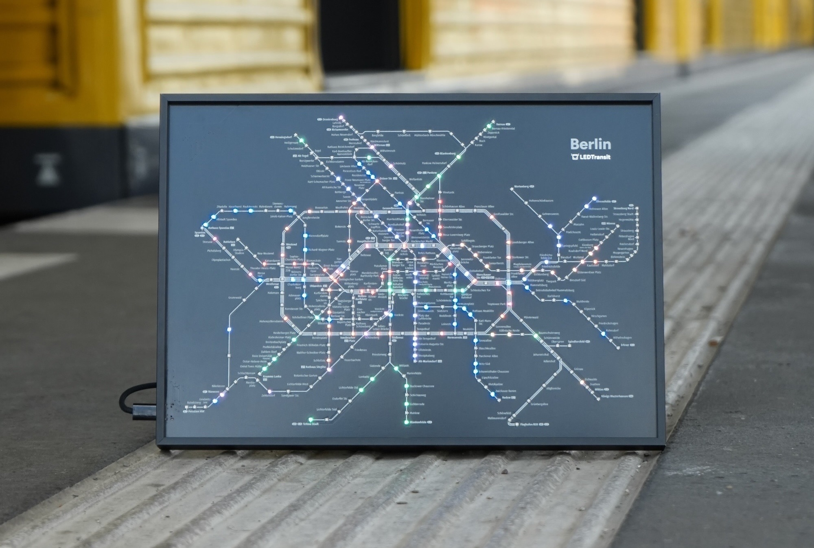

<div>

<h1>Firmware for the LEDTransit Maps</h1>
</div>

This repository contains the firmware running on the LEDTransit maps &mdash; a series of pixel-based public transport maps designed and manufactured by [LEDTransit](https://ledtransit.com/).

The maps are powered by an ESP32-C3 (RISC-V) microcontroller and feature a custom PCB with an on-board JTAG USB interface for programming and debugging, as well as an LED chain for displaying the position of public transport vehicles in real-time.

The firmware is written in Rust using the `esp-hal` and `embassy` no_std/async frameworks and can be built from source and installed on the device by following the instructions below.

<div class="grid" markdown>




</div>

## Toolchain installation

Required tools: Rust toolchain (1.88 or newer) with the `riscv32imc` target, `probe-rs` dev tools, `espflash` flasher, `protoc` protobuf compiler.

<details open>
<summary>macOS Homebrew</summary>

```sh
brew install protobuf
curl --proto '=https' --tlsv1.2 -sSf https://sh.rustup.rs | sh
rustup toolchain install stable --component rust-src
rustup target add riscv32imc-unknown-none-elf
curl --proto '=https' --tlsv1.2 -LsSf https://github.com/probe-rs/probe-rs/releases/latest/download/probe-rs-tools-installer.sh | sh
cargo install espflash --locked
```

</details>

<details>
<summary>Linux Ubuntu</summary>

```sh
apt update && apt install -y curl build-essential protobuf-compiler ca-certificates
curl --proto '=https' --tlsv1.2 -sSf https://sh.rustup.rs | sh
rustup toolchain install stable --component rust-src
rustup target add riscv32imc-unknown-none-elf
curl --proto '=https' --tlsv1.2 -LsSf https://github.com/probe-rs/probe-rs/releases/latest/download/probe-rs-tools-installer.sh | sh
cargo install espflash --locked
```

A working Ubuntu build environment is also available as a Docker image ([assets/docker/Dockerfile](assets/docker/Dockerfile)), used for automated builds:

```sh
docker build -t fw-ledtransit-map assets/docker
docker run --rm -v "$PWD":/workspace -e PRODUCT=bln1-2512-1 fw-ledtransit-map
```

</details>

Check that the tools are correctly installed:

```sh
cargo xtask doctor
```

Rebuilding the bootloader (`cargo xtask bootloader`) additionally requires [ESP-IDF](https://docs.espressif.com/projects/esp-idf/en/stable/esp32c3/get-started/) with the `IDF_PATH` environment variable set. The repository already contains the built bootloader, so this is only needed when changing it.

For IDE integration, you may also want to install the [rust-analyzer](https://github.com/rust-lang/rust-analyzer) extension. Set the `PROTOC` environment variable to the path of the `protoc` binary and configure the default build target to `riscv32imc-unknown-none-elf` (for an example see [.vscode/settings.json](.vscode/settings.json)).

## Build the firmware

Build the firmware for a specific product ([see Supported Products](#supported-products)). If no product is specified, the command attempts to auto-detect a connected device and builds for that product.

```sh
cargo xtask build # <product>
# Example: cargo xtask build bln1-2512-1
```

Always build through `cargo xtask`: it selects the product and its settings. A plain `cargo build` only builds a virtual product (for tooling such as rust-analyzer), which doesn't run on a map, and warns about it.

## Connect the device

- Connect a LEDTransit map to your computer using a USB-C data cable.
- Allow the USB device to connect when prompted.
- A JTAG/serial device should appear among your USB devices:

<details open>
<summary>macOS 26+</summary>

```sh
$ system_profiler SPUSBHostDataType
>   USB JTAG/serial debug unit:
>        Location ID: 0x00140000
>        Connection Type: Removable
>        ...
```

</details>

<details>
<summary>Linux</summary>

```sh
$ lsusb | grep JTAG
Bus 001 Device 001: ID 303a:1001 303a USB JTAG/serial debug unit  Serial: DC:06:32:B7:CD:29
```

</details>

A standard 500 mA USB 2.0 port is sufficient to power the device for small brightness levels.

## Flash the firmware

Build, flash and monitor the firmware with the `run` command. If no product is specified, the command auto-detects the connected device and flashes the corresponding firmware.

```sh
cargo xtask run # <product>
```

The firmware is flashed to the factory partition. If the device currently boots an over-the-air update instead, its boot selection is reset so it boots the flashed firmware.

Your own builds work like the official firmware, including the connection to the LEDTransit server: the device authenticates with keys stored in its eFuses, which flashing doesn't touch. Over the air, the device only installs firmware signed by LEDTransit ([see Secure Over-the-Air Updates](docs/SECURE_OTA.md)).

> [!NOTE]
> When the log output of the device is monitored using the `probe-rs` tool invoked by `cargo xtask monitor` or `cargo xtask run`, the LEDs will flicker due to timing issues. This is expected behavior and can be resolved by detaching the RTT logger with Ctrl-C after the firmware has booted and the log output is no longer needed.
>
> When halting the CPU in a debugger (e.g. at a breakpoint), the hardware watchdog resets the device after 30 seconds.

> [!WARNING]
> Program the device at your own risk. Burning E-Fuses is irreversible and may permanently make the device unusable for the application.
> Exceeding the maximum current rating of the board may trip the resettable on-board fuse.
> Exceeding the maximum current rating of your computer's USB port may disconnect the device or damage your computer.

### Development options

`build` and `run` take options to override settings of the firmware, for development:

| Option | Description |
| --- | --- |
| `--log <level>` | Log level: `off`, `error`, `warn`, `info` (default), `debug`, `trace` |
| `--wifi-ssid <ssid>`, `--wifi-pw <password>` | WiFi credentials, to skip the WiFi setup |
| `--prov-token <token>` | Provisioning token to claim the device with, to skip the setup page |
| `--gw-host <host>`, `--gw-port <port>` | LEDTransit server to connect to, e.g. a local one |
| `--ssl-enable <true\|false>` | TLS for the server connection (on by default, release builds always require it) |

## Commands

All tasks run through `cargo xtask` ([xtask/](xtask/)):

| Command | Description |
| --- | --- |
| `cargo xtask doctor` | Check the development environment is set up correctly |
| `cargo xtask build [product]` | Build the development firmware |
| `cargo xtask run [product]` | Build, flash and monitor the development firmware |
| `cargo xtask monitor` | Monitor the device's log output. Decoding only works if the firmware on the device is exactly the one built locally (`target/riscv32imc-unknown-none-elf/release/fw-ledtransit-map`), so build and flash it once with `cargo xtask run` first |
| `cargo xtask detect` | Detect which product is connected, and its firmware version |
| `cargo xtask clippy [--fix] [--allow-dirty]` | Run the clippy linter |
| `cargo xtask prov-server` | Rebuild the setup page's files into `assets/prov_public` after changing `prov_server/public` |
| `cargo xtask bootloader` | Rebuild the bootloader into `assets/boot_image` (requires ESP-IDF) |
| `cargo xtask release <product> [--install] [--staging]` | Build a signed over-the-air release into `target/ota`, from a clean commit tagged with the package version (e.g. `1.1.1`). `--staging` allows any commit, with a warning, to test a release before tagging it. Requires LEDTransit's private signing key |
| `cargo xtask factory <product>` | Build and install the factory firmware, from a clean commit tagged with the package version |

## Recovery

### Bootloader mode

If the device is in a state where it cannot be programmed (e.g. the USB interface was re-configured from within the firmware or the LEDs exceed the USB port's current limit and trigger a device eject), you can force the device into bootloader mode by holding the middle button (circle icon) on the back side while plugging in the USB cable.
The application firmware will not boot in this mode, allowing you to re-flash the device using the `cargo xtask run` command.
After flashing, detach and re-attach the USB cable without holding the button to boot into the application firmware once again.

### Factory reset

Holding the down button for 5 seconds while the device starts (power-on or any reboot) makes the bootloader boot the factory firmware and erase the settings, so the device starts in setup mode.
This works even when the installed application firmware doesn't (e.g. it crashes or hangs), as it's done by the bootloader (`CONFIG_BOOTLOADER_FACTORY_RESET` in `bootloader/sdkconfig.defaults`, built with `cargo xtask bootloader`).

In the running firmware, holding the up and down buttons together for 2 seconds also performs a factory reset.

## Supported Products

| Product     | Model                             | Year | Status                                                                                     | MCU      |
| ----------- | --------------------------------- | ---- | ------------------------------------------------------------------------------------------ | -------- |
| bln2-2512-1 | Berlin Rapid Transit Lightmap XL  | 2026 | [Available for purchase](https://ledtransit.com/products/berlin-s-und-u-bahn-livekarte-xl) | ESP32-C3 |
| bln1-2512-1 | Berlin Rapid Transit Lightmap     | 2025 | [Available for purchase](https://ledtransit.com/products/berlin-s-und-u-bahn-livekarte)    | ESP32-C3 |
| bln1-2412-1 | Berlin Rapid Transit Lightmap Dev | 2024 | Internal, not supported by this firmware                                                   | ESP32-C3 |

## Technical Reference

- [Secure Over-the-Air Updates](docs/SECURE_OTA.md): signed updates, dual bank, rollback and factory reset
- [WiFi Provisioning](docs/WIFI_PROVISIONING.md): setup network, setup page and claiming the device for an account

## Project structure

```text
├── assets              : Static files
│   ├── boot_image      : Bootloader binary image built from /bootloader
│   ├── certs           : TLS certificate bundle
│   ├── docker          : Dockerfile for automated builds
│   ├── images          : Images embedded in markdown documentation
│   ├── prod_config     : Product configuration files (auto-generated)
│   ├── proto_schema    : Protobuf schema of the messages exchanged with the LEDTransit server
│   ├── prov_public     : Setup page files built from /prov_server
│   └── secure_ota      : Public key to verify signed OTA updates
├── bootloader          : ESP-IDF bootloader project (configuration only)
├── docs                : Technical reference
├── prov_server         : Setup page source and build tool (Rust)
├── src                 : Firmware source code (Rust)
│   ├── display         : LEDs, animations, and drawing the rendered state
│   │   └── renderer    : Where vehicles and disruptions show on the map
│   ├── net             : WiFi
│   │   ├── provisioning : Setup network: DHCP server and setup page
│   │   └── ws_client   : Authenticated connection to the LEDTransit server
│   ├── ota             : Secure over-the-air updates
│   └── store           : Settings and transit data
│       ├── app_settings : Settings in flash and RAM, device info
│       └── transit_data : Transit data from the server, mapped to the map's locations
├── xtask               : Build and utility tasks (Rust)
├── build.rs            : Product selection and protobuf code generation
└── partitions.csv      : Flash partition table
```

The modules directly in `src` cover the entry point (`main.rs`), product configuration, buttons and their actions, the day-night timer and sunlight brightness, device authentication with the eFuse keys, error reporting, the watchdog, and the production serial interface.

## Contributing

Contributions to the firmware are welcome! Please open an issue or submit a pull request if you have any suggestions or improvements.

## License

The firmware is licensed under the [GPL-3.0](https://www.gnu.org/licenses/gpl-3.0.en.html) license. See the [LICENSE](LICENSE) file for details.
Meaning that you are free to use, modify, and distribute the firmware, but any derivative works must also be released open-source under the same license.
