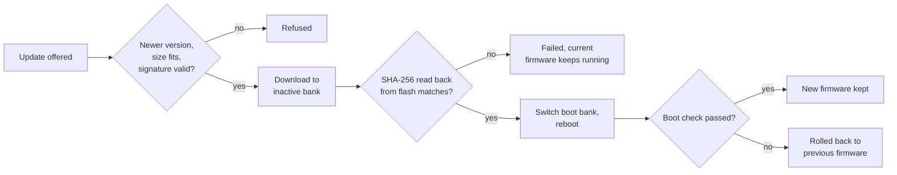

# Secure Over-the-Air updates (DFU)

How LEDTransit maps update their firmware over the air (OTA), and what protects
them from malicious, corrupted or broken updates. The implementation is in
[`src/ota/`](../src/ota/).

## Overview

1. **Offer:** the LEDTransit server tells a connected map that a new version is
   available: version, image URL, size, SHA-256 hash and signature
   (`DeviceUpdate` in the [protocol](../assets/proto_schema/ledtransit_client.proto)).
2. **Start:** with automatic updates on, the map starts 5 minutes later
   (cancelled if the owner turns automatic updates off in the meantime).
   Otherwise the owner starts it from the app, or with a long press on the
   Down button.
3. **Install:** the map checks version, size and signature, downloads the
   image into its inactive flash bank, verifies the image's hash, switches the
   boot bank and reboots.
4. **Confirm:** the new firmware has to show that it works. If it doesn't, the
   map goes back to the previous firmware.

## Partition layout

From [`partitions.csv`](../partitions.csv) (4 MB flash):

| Partition | Offset | Size | Content |
|---|---|---|---|
| `otadata` | `0xD000` | 8 KiB | Which app partition to boot, and its state |
| `factory` | `0x10000` | 1340 KiB | Firmware flashed at production, never overwritten over the air |
| `ota_0` | `0x160000` | 1340 KiB | Update bank |
| `ota_1` | `0x2B0000` | 1340 KiB | Update bank |
| `settings` | `0x2AF000` | 4 KiB | WiFi credentials and configuration |

A firmware image can be at most 1,372,160 bytes (`0x14F000`).

## Dual bank

An update is always written to the bank that isn't running: `ota_0` and `ota_1`
take turns (the first update after the factory firmware goes to `ota_0`). The
running firmware is never touched, so a download can be interrupted at any
point (power loss, network outage) without harm. The map only switches to the
new bank after all checks below have passed.

## Secure channel

- Images are downloaded over HTTPS only, on port 443.
- The server certificate must be valid for the image URL's hostname, chained to
  a root in the CA bundle compiled into the firmware (mbedtls, verification
  required). The hostname is also sent as SNI.
- Release builds can't be built without TLS.

The update's security doesn't depend on TLS alone: the signature and hash
checks below hold over any channel.

## Signature verification

Every update is signed by LEDTransit with ECDSA on the NIST P-256 curve, over
SHA-256 of this message:

| Field | Encoding |
|---|---|
| Version major, minor, patch | 3 × `u32`, little endian |
| Image size in bytes | `u32`, little endian |
| Image SHA-256 hash | 32 bytes |
| Product ID (e.g. `bln1-2512-1`) | UTF-8, the rest of the message |

- The firmware verifies the signature with the public key compiled into it
  ([`assets/secure_ota/p256_ota_public_key.der`](../assets/secure_ota/p256_ota_public_key.der)),
  **before downloading anything**. An invalid signature is refused, and the
  inactive bank isn't touched.
- The product ID binds the image to the hardware: a correctly signed image for
  another product (other LED layout, other pins) is refused.
- The image URL isn't signed and doesn't need to be: whatever it serves must
  match the signed hash.

## Version policy

- Only newer versions are installed. Older ones are refused, even though signed,
  so a map can't be downgraded to a release with known bugs.
- The same version is only installed over a development (beta) build of it.
- The version checked is part of the signed message.

## Integrity check

- The signed size must fit the app partition before the download starts, and
  the server's `Content-Length` must equal it.
- The image is written to the inactive bank in 4 KiB chunks.
- After the download, the firmware **reads the image back from flash** and
  computes its SHA-256 with the chip's hardware accelerator. It must equal the
  signed hash. This catches a swapped image, transfer errors and faulty flash
  writes alike.
- Only then does the map switch its boot bank and reboot.

## Boot validation and rollback

The map uses the ESP-IDF bootloader's app rollback. A new image starts out
unconfirmed. If the map reboots before the firmware confirms the image, the
bootloader marks it as failed and boots the previous firmware again.

The firmware confirms a new image only after this **boot check**: it booted
without a panic, read its settings, connected to WiFi, authenticated with the
LEDTransit server over TLS, and received, decoded and processed transit data.

Three safety nets make sure a broken image actually reboots:

- **Panic:** a panic resets the chip.
- **Watchdog:** the chip's RTC watchdog resets it when the LED drawing loop,
  which always runs, makes no progress for 30 seconds
  ([`src/watchdog.rs`](../src/watchdog.rs)).
- **Boot-check timeout:** an image still unconfirmed 10 minutes after booting
  reboots the map.

After a rollback, the map reports `is_rolled_back_firmware` to the server.

Once confirmed, an image is kept. Problems that only show later, such as
breaking the next update or the WiFi setup, can't be caught this way. Every
release is therefore installed and tested on maps before it's rolled out.

## Factory reset

The factory firmware is a known-good fallback. A factory reset erases the
settings and the boot selection (`otadata`), so the map boots the factory
firmware in setup mode, and then updates itself to the latest version again.

- **From the firmware:** long press on Up and Down together, or from the app.
- **From the bootloader:** hold the Down button for 5 seconds while the map
  starts. This works even when the installed firmware doesn't (crash loop,
  hang). The middle button can't be used here: holding it at power-on puts the
  chip into USB download mode.

## Bootloader

The map runs the stock ESP-IDF (v5.5.2) bootloader, built from
[`bootloader/`](../bootloader/) with app rollback and the factory reset button
enabled ([`sdkconfig.defaults`](../bootloader/sdkconfig.defaults)). The
bootloader isn't updated over the air: it's flashed over USB together with the
firmware.

## Failure handling

- The download runs in its own task. Timeouts of 10 seconds apply to the DNS
  lookup, connecting, the response, and each 4 KiB chunk, so a slow or
  unresponsive server can't stall the map.
- On any failure, the current firmware keeps running, the status LED shows the
  failed update, and the update is offered again later.
- While downloading, the map reports progress and speed. The status LED shows
  when an update is available, in progress, or failed. The map also reports
  whether it runs the factory firmware or a rolled back one.

## Releases and signing

- Releases are built with `cargo xtask release`, only from a clean commit
  tagged with the firmware's version (e.g. `1.1.1`), as non-beta builds with
  TLS. The tool signs the update and verifies the signature with the public
  key.
- Builds for testing on staging maps (`--staging`) may come from an untagged
  commit, with a warning. They're meant for testing only.
- The private signing key is kept offline by LEDTransit and is never part of
  this repository.
- A new signing key can only reach maps through an update signed with the
  current key.

## Limitations

- **No secure boot or flash encryption,** by design: the firmware is open
  source, and you can flash your own build over USB. Over the air, maps only
  install firmware signed by LEDTransit.
- **The factory firmware is older** than the current release until the map
  updates again after a factory reset.
- **The bootloader can't be updated over the air.**
