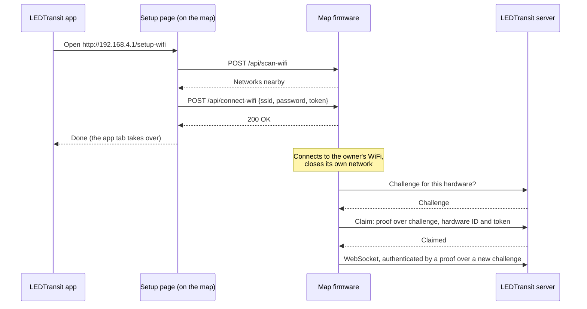

# WiFi Provisioning

How a LEDTransit map gets onto the owner's WiFi and into their account: the
map opens its own WiFi network with a setup page, and once it's on the owner's
network, it claims itself for their account with its device keys. The
implementation is in [`src/net/`](../src/net/).

## Overview

1. **Setup mode:** the map opens an open WiFi network named
   `LEDTransit-XXXXXX` (from its MAC address) and serves the setup page at
   `http://192.168.4.1`. Its status LED blinks blue, and snakes wander over
   the map.
2. **Setup page:** the LEDTransit app opens the page in a new tab, with a
   short-lived provisioning token for the owner's account. The owner joins the
   map's network, picks their WiFi from the page's scan and enters the
   password.
3. **Connect:** the map connects to that WiFi, saves the credentials and the
   token, and closes its own network.
4. **Claim:** the map proves to the LEDTransit server that it's a genuine
   device, for this token. The server links it to the owner's account, and the
   token is used up.
5. **Connect to the server:** from then on, the map connects with a proof of
   its device keys, no stored password or access token.

## When setup mode starts

- **First boot,** or whenever the map has no WiFi credentials or isn't claimed
  for an account.
- **Middle button** held for 2 seconds.
- **From the app** (re-setup command), e.g. to move the map to another WiFi.
- **The server no longer links the map to an account** (e.g. it was removed in
  the app), or **refuses the claim** (token expired or invalid).
- **After a factory reset,** which erases the credentials.

Starting setup mode erases the stored WiFi credentials, marks the map as not
claimed, and closes the connection to the server.

## Setup network

| | |
|---|---|
| SSID | `LEDTransit-` and the last 3 bytes of the MAC address (e.g. `LEDTransit-A1B2C3`) |
| Security | Open (no password), see [Limitations](#limitations) |
| Address | `192.168.4.1/24`, DHCP server for up to 4 clients |
| Web server | HTTP on port 80, up to 4 connections at once |

The map runs as access point and station at the same time: it keeps its own
network up while it connects to the owner's WiFi, so the setup page can report
the result.

## Setup page

The page is built from [`prov_server/`](../prov_server/) (translated into
English and German, minified, gzipped) and embedded in the firmware
([`static_files.rs`](../src/net/provisioning/static_files.rs)). `?lang=de`
selects German.

- **Provisioning token:** the app passes it in the URL fragment
  (`#tok=…`), which browsers never send to a server, so it doesn't show up in
  requests. The page removes it from the address bar and keeps it for its tab
  only (to survive a reload).
- **Hand-over:** once the map accepted the credentials, the page tells the app
  tab, which continues the setup once the phone is back on the internet. The
  setup page then closes, or continues there itself without the app tab.

## Portal API

All requests go to the map at `192.168.4.1`
([`portal.rs`](../src/net/provisioning/portal.rs)).

| Request | Answer |
|---|---|
| `GET /probe` | `204`: lets the app tell the map is reachable |
| `POST /api/identify` | Lights all pixels green for a second, to tell maps apart |
| `POST /api/scan-wifi` | The 16 strongest networks: SSID, signal strength, whether open |
| `POST /api/connect-wifi` | Connects to `{ssid, password, token}` (JSON) |

`/api/connect-wifi` answers:

- `415` unless the request is `Content-Type: application/json`. A page of
  another origin can't send JSON without a CORS preflight, which fails here,
  so it can't submit credentials through the owner's browser.
- `401` without a provisioning token.
- `500` if the map can't connect (status LED alternating yellow and red).
- `200` once connected. The map then saves the credentials and the token,
  waits 8 seconds for the page to finish, and switches to station only.

## Claiming

The map can only be claimed by proving it's a genuine LEDTransit device. Each
map has two random keys burned into its chip's eFuses at production. They're
read-protected: no software, not even other firmware flashed onto the map,
can read them. The chip's HMAC peripheral only computes with them
([`device_auth.rs`](../src/device_auth.rs)).

1. The map asks the server for a challenge for its hardware ID (the chip's
   unique ID).
2. It computes HMAC-SHA256 with its device key over a label, the challenge,
   its hardware ID and the provisioning token
   (`ledtransit/claim/v1 ‖ 0 ‖ challenge ‖ 0 ‖ hardware ID ‖ 0 ‖ token`).
3. It sends the claim with the proof, its product, hardware and firmware
   version ([`auth.rs`](../src/net/ws_client/auth.rs)).

The proof binds the device to this token: the token alone claims nothing, and
a claim can't be made without the device. If the server refuses the claim,
the map clears the token and goes back into setup mode.

Connecting to the server afterwards works the same way, with a fresh
challenge each time and its own label (`ledtransit/connect/v1`), as part of
the WebSocket upgrade.

## Status LED

| Status | LED |
|---|---|
| Setup mode | Blinking blue |
| Connecting to WiFi | Blinking yellow |
| WiFi connection failed | Alternating yellow and red |
| Connecting to the server | Blinking green |
| Connection refused by the server (device keys, blocked device) | Alternating blue and red |
| Connected | Green |

## Stored data

The settings partition in flash holds the WiFi SSID and password, the
provisioning token until the claim, and whether the map is claimed
([`persist.rs`](../src/store/app_settings/persist.rs)). Nothing else is needed
to connect: the device keys stay in the eFuses, so a full flash erase only
means setting the map up again. A factory reset erases the settings,
including the WiFi credentials.

## Limitations

- **The setup network is open:** anyone in range during setup mode can join it
  and read the WiFi password from the unencrypted traffic, or submit their own
  token first. Setup mode only runs when started (see above), and pressing the
  middle button takes the map back.
- **Possession is ownership:** whoever has the map can set it up for their
  account, like many smart-home devices. There's no activation lock.
- **2.4 GHz networks only** (ESP32-C3).
